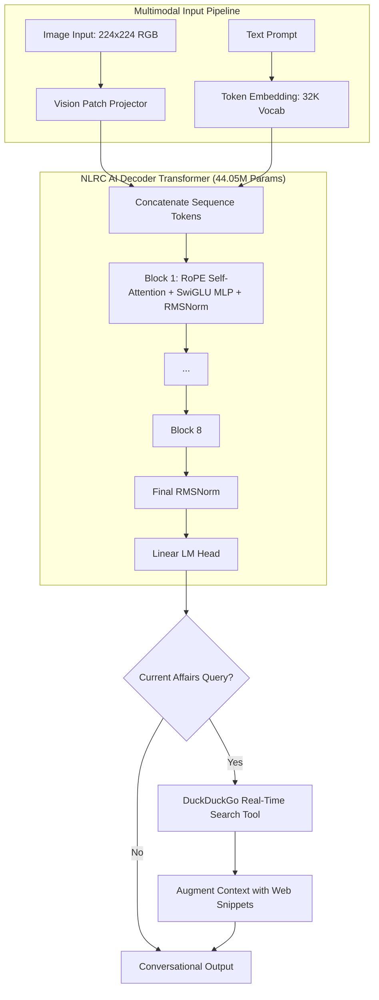

# 🚀 NLRC AI — Multimodal & GRPO Reasoning Intelligence

[](https://huggingface.co/spaces/RamcharanToom/NLRC-AI)
[](https://ck528824--nlrc-ai-mobile-web.modal.run)
[](https://toomramcharan.github.io/NLRC-AI-Training/)
[](https://colab.research.google.com/github/ToomRamcharan/NLRC-AI-Training/blob/main/NLRC_AI_GRPO_Reasoning.ipynb)
[](LICENSE)
[](https://pytorch.org/)

**NLRC AI** is an advanced multimodal AI model equipped with authentic **Group Relative Policy Optimization (GRPO)** chain-of-thought reasoning (DeepSeek-R1 style), native visual image patch projection, and integrated real-time web search for worldwide current affairs.

---

## 🌟 Core Capabilities

| Capability | Architecture & Implementation |
| :--- | :--- |
| **🖼️ Image Analysis** | Dedicated **Vision Patch Projector** ($16 \times 16$ patches) projecting image features directly into the Transformer hidden embedding space for joint multimodal reasoning. |
| **💬 Conversational Chat** | Decoder-only Transformer trained from scratch with **RoPE** (Rotary Positional Embeddings), **SwiGLU** feed-forward layers, and **RMSNorm** (based on [FareedKhan-dev/train-llm-from-scratch](https://github.com/FareedKhan-dev/train-llm-from-scratch)). |
| **🌐 Current Affairs QA** | Dynamic Tool-Augmented Retrieval via **DuckDuckGo Search**, enabling the model to retrieve real-time breaking news beyond static cutoff dates. |
| **☁️ Zero-Local Cloud Footprint** | 100% cloud-based execution inside Google Colab (Google AI Pro GPU) using the official **Google Colab MCP**. |

---

## 🏗️ Architecture



---

## 📁 Repository Structure

```
NLRC-AI/
├── src/
│   └── nlrc_ai_from_scratch.py    # Complete PyTorch model & search tool
├── tools/
│   ├── run_training_on_colab.py   # Colab MCP cloud training automation
│   ├── test_nlrc_ai.py            # Automated capability test runner
│   └── start_colab_bridge.py      # Local WebSocket proxy launcher
├── NLRC_AI_From_Scratch.ipynb     # Turnkey Google Colab training notebook
├── app.py                         # Interactive Gradio web interface
├── requirements.txt               # Dependencies
└── README.md                      # Documentation
```

---

## 🚀 Quickstart & Training

### 1. Cloud Training via Google Colab
1. Open [`NLRC_AI_From_Scratch.ipynb`](NLRC_AI_From_Scratch.ipynb) in [Google Colab](https://colab.research.google.com/).
2. Select your GPU accelerator (**Runtime ➔ Change runtime type ➔ A100 GPU / L4 GPU**).
3. Run all cells to stream open-source datasets, train the model, and save checkpoints to Google Drive.

### 2. Launch the Web Interface
To run the interactive Gradio chat and vision app:
```bash
pip install -r requirements.txt
python app.py
```
This launches a local dashboard and generates a public URL (`https://xxxx.gradio.live`) to share and use on any device.

---

## 📜 License
Distributed under the MIT License. Built with inspiration from [Fareed Khan's train-llm-from-scratch](https://github.com/FareedKhan-dev/train-llm-from-scratch).
